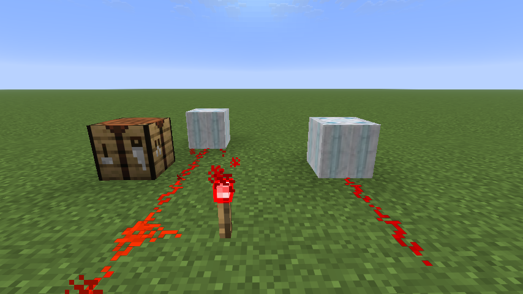

# Ancient Computer



A Minecraft mod that adds ancient computers capable of wirelessly transmitting redstone signals across any distance.

This is my first minecraft mod and I built it just to learn about the process. It's been pretty interesting to be honest.

## Features

- **Ancient Computer Block**: A redstone device that can send and receive wireless signals 32 blocks away to another **Ancient Computer**
- **Linking Device**: Tool used to link computers together
- **Echo Dust**: A new material used in crafting, obtained from echo shards
- **Echo Dust Block**: Storage block for echo dust

## Crafting

**Ancient Computer**

```
Polished Diorite x6
Echo Shard x1
Observer x2
```

## Usage

1. Craft an Ancient Computer and Linking Device
2. Place two or more Ancient Computers in the world
3. Use the Linking Device to link them together
4. Power one computer with redstone to wirelessly transmit the signal to linked computers

## Technical Details

- Supports Minecraft 1.21.11
- Built with Fabric Loader 0.18.4
- All textures and sounds were generated using AI

## License

CC0-1.0
